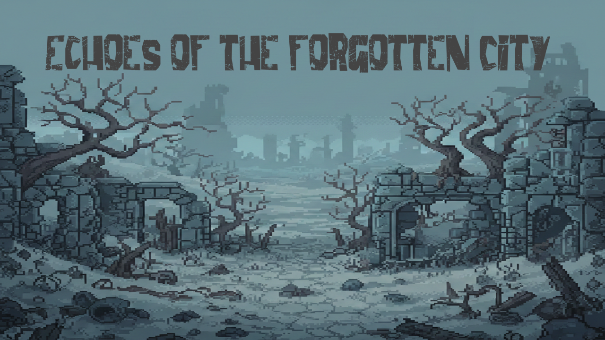

# Echoes of The Forgotten City

## Game Description

**Echoes of the Forgotten City** is a 2D puzzle-platformer set in a mysterious ancient ruin filled with traps and hidden mechanisms. Players explore different locations, solve challenging puzzles triggered by magical bubbles, and avoid deadly hazards. The game combines strategy, timing, and exploration to uncover secrets and ultimately escape the cursed city

## Features
-	Bubble interaction system that triggers different puzzles
-	Multiple puzzle types (memory, flow, scale, statue rotation)
-	Advanced trap mechanisms (fire, blades, cursed beams)
-	Inventory system for collecting and using items
-	Sword mechanic to fight enemies
-	Abrupt wolf chase sequences for high difficulty
-	Timer-based challenges with increasing difficulty

## Project Details
IDE: Visual studio 2010/2013

Language: C,C++.

Platform : Windows PC.

Genre : 2D puzzle/action adventure

## How to Run the Project

Make sure you have the following installed:
- **Visual Studio 2013**
- **MinGW Compiler** (if needed)
- **iGraphics Library** (included in this repository)

Open the project in Visual Studio 2013
- Open Visual Studio 2013.
- Go to File → Open → Project/Solution.
- Locate and select the .sln file from the cloned repository.
- Click Build → Build Solution
- Run the program by clicking Debug → Start Without Debugging

## How to Play

### **Controls**
| Player       | Move Left | Move Right | Jump       | Pop/Collect| Sword Fight | Skip |
|-------------|----------|-----------|-----------|-------|------|-------|
| **Player 1** | `A`      | `D`       | `W`       | `F`   | `J`  | `S`   |

### **Game Rules**

The player must avoid all traps (fire, beams, blades, etc.) or health will decrease.

The player must pop special bubbles to unlock and trigger puzzles.

Puzzles must be solved correctly to open gates and progress.

If the timer runs out, the game ends immediately.

In Level 3, the player must collect the sword before facing the wolves.

The player can defeat wolves using the sword or escape them to survive.

## Project Contributors

1. Rupai
2. Adiba
3. Anika

## Screenshots

### **Menu**

### **Character**

## Youtube Link
[Echoes of The Forgotten City](https://youtu.be/BNoWttjdvpc)

## Project Report
[Project Report: The Fallen Kingdom](https://drive.google.com/drive/u/1/my-drive)
